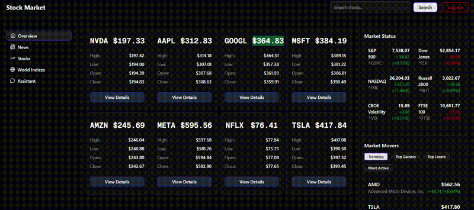
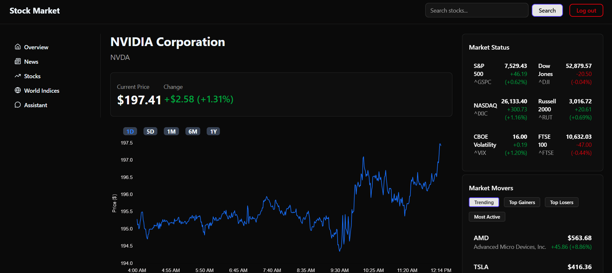
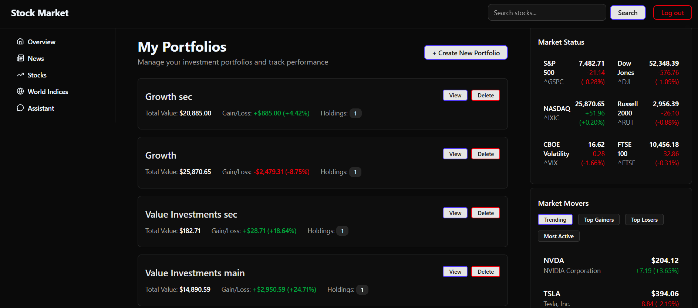
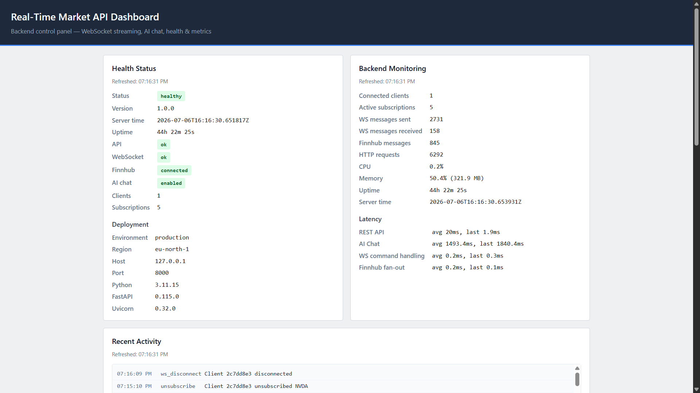
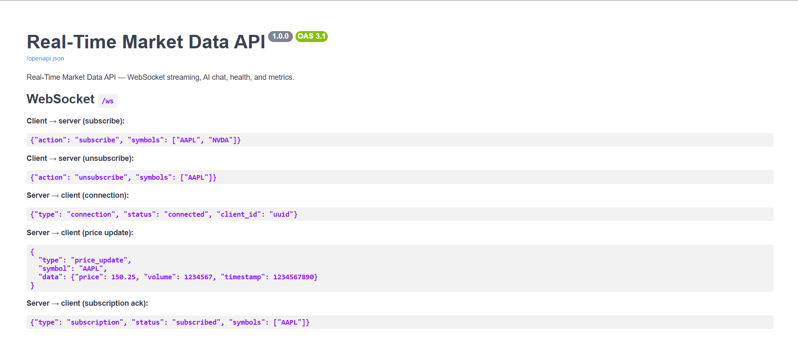

# Stock Market — Portfolio Manager & Real-Time Market API

Production full-stack app for portfolio tracking, watchlists, live market data, and an AI assistant.

**[Live App](https://stock-market-seven-delta.app)** ·
**[API Dashboard](https://api.stock-market-seven-delta.app)** ·
**[OpenAPI Docs](https://api.stock-market-seven-delta.app/docs)**


Deployed on **Vercel** (frontend) + **AWS EC2** (backend) + **Supabase** (PostgreSQL + RLS).

## Demo



## Screenshots

| Stock chart | Portfolio manager |
|-------------|-------------------|
|  |  |

| API metrics                                           | OpenAPI / Swagger                        |
| ----------------------------------------------------- | ---------------------------------------- |
|  |  |

## Highlights

- **Real-time backend** — FastAPI WebSocket fan-out from Finnhub; `/health`, `/metrics`, `/activity` endpoints
- **Performance** — ~20 ms REST avg under normal load; k6-tested at 100 VUs (~263 req/s, p95 ~85 ms, 100% success) — [details](docs/PERFORMANCE.md)
- **Cloud deploy** — AWS EC2 + Nginx + HTTPS; GitHub Actions OIDC + SSM Parameter Store; CloudWatch alarms
- **Full-stack app** — Next.js 16 on Vercel; 19 API routes; Supabase Auth (OAuth + JWT) + 7 RLS-protected tables
- **AI** — Gemini assistant with moderation, rate limiting, and input validation

## Architecture

```
┌─────────────────────────────────────────────────────────┐
│                    Application Stack                    │
├─────────────────────────────────────────────────────────┤
│  Frontend (Next.js 16)  →  Vercel                       │
│  Backend (FastAPI)      →  AWS EC2 + Nginx + TLS        │
│  Database               →  Supabase PostgreSQL + RLS    │
│  Real-time data         →  Finnhub WebSocket            │
│  Market data            →  Yahoo Finance API            │
└─────────────────────────────────────────────────────────┘
```

See [docs/ARCHITECTURE.md](docs/ARCHITECTURE.md) for auth flows, trust boundaries, and deployment topology.

## Tech stack

| Layer    | Technologies                                                        |
| -------- | ------------------------------------------------------------------- |
| Frontend | Next.js 16, React 19, TypeScript, Tailwind CSS, Shadcn UI, Chart.js |
| Backend  | FastAPI, Uvicorn, WebSockets, Finnhub, Gemini, OpenAPI/Swagger      |
| Data     | Supabase, PostgreSQL, RLS, OAuth, JWT                               |
| Cloud    | AWS EC2, Nginx, SSM, CloudWatch, GitHub Actions (OIDC)              |
| Hosting  | Vercel (frontend)                                                   |

## Quick start

```bash
# Backend
cd backend && pip install -r requirements.txt && python main.py

# Frontend (separate terminal)
cd frontend && npm install && npm run dev
```

- Frontend: http://localhost:3000
- Backend: http://localhost:8000
- API docs: http://localhost:8000/docs

Full setup (env vars, production URLs, API reference): **[docs/GETTING_STARTED.md](docs/GETTING_STARTED.md)**

## Documentation

- [Getting Started](docs/GETTING_STARTED.md) — local setup and API reference
- [Architecture](docs/ARCHITECTURE.md) — system design, auth, and deployment
- [Performance & Load Testing](docs/PERFORMANCE.md) — metrics and k6 benchmarks
- [Environment Variables](ENVIRONMENT_VARIABLES.md)
- [Backend Deploy (AWS)](backend/deploy/README.md)
- [Frontend](frontend/README.md) · [Backend](backend/README.md)

## Production URLs

| Service     | URL                                           |
| ----------- | --------------------------------------------- |
| Frontend    | https://stock-market-seven-delta.app          |
| Backend API | https://api.stock-market-seven-delta.app      |
| API docs    | https://api.stock-market-seven-delta.app/docs |
| WebSocket   | wss://api.stock-market-seven-delta.app/ws     |

## Author

**Elias Abeba** — [LinkedIn](https://www.linkedin.com/in/elias-abeba) · [GitHub](https://github.com/eli22443)

Student portfolio project · Ben-Gurion University of the Negev

**Status:** Production deployed · **Version:** 0.0.1
